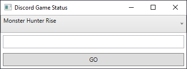
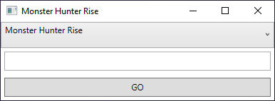
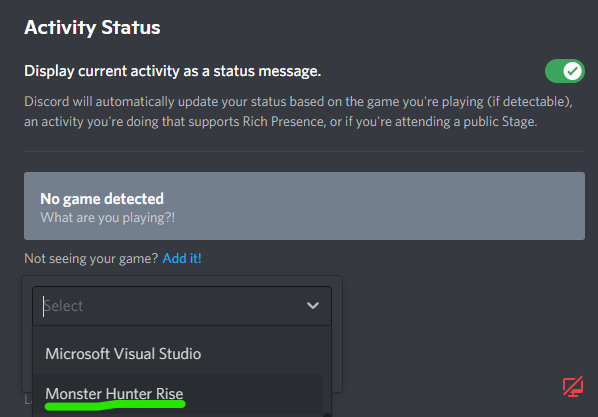
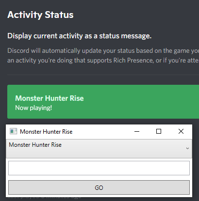
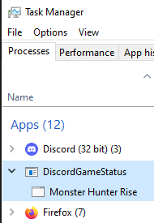
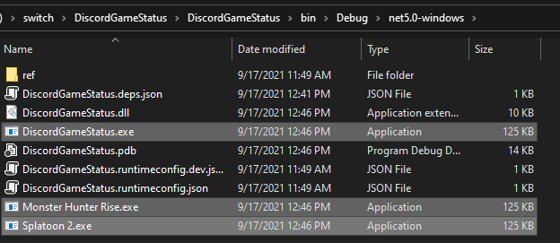

# discord-anything-status

This is real quickly hacked together.

Program will launch as "Discrod Game Status". Do NOT add this to discord's activity status.
First, set the active game by either the dropdown or the input textbox and clicking GO.

From here you can add the game manually in discord's activity status. I'd love to get this to auto-detect, but am unsure the mechanism (authorship?) atm. Unforunately that means adding it per game title.

How this works... discord seems to associate by the process name and exe name. It's not enough to just rename the process or discord will only think it's a single game. What this program does is duplicate its executible by game name, kill the active process, and relaunch a new one. 

